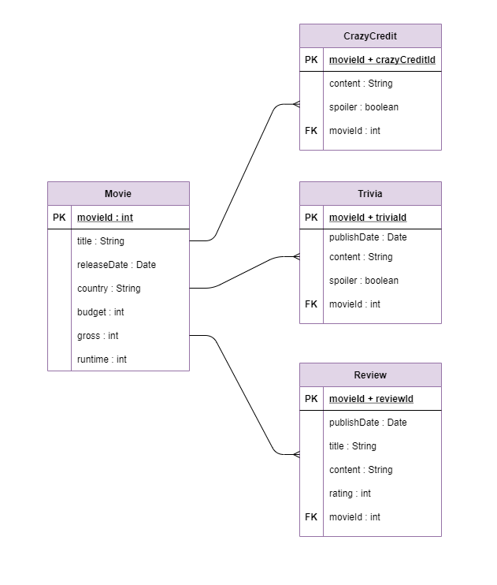
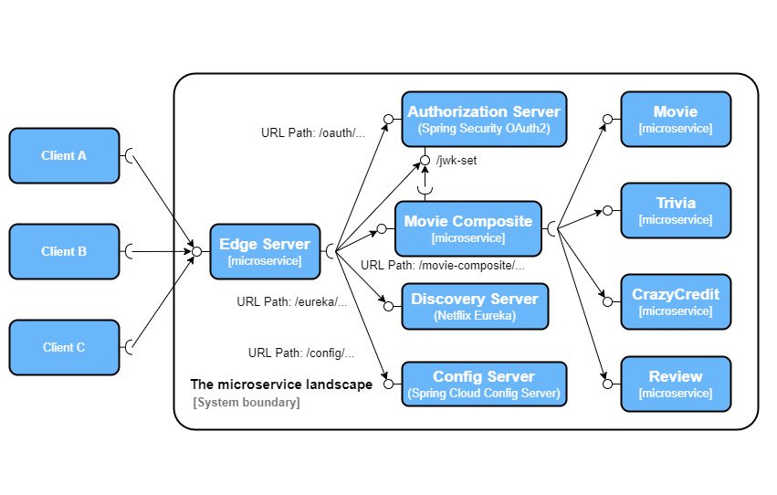

# Movinf-microservices

Movie information service that is based on the microservice architecture, implemented with Spring Boot and Spring Cloud. The buisness logic is applied through a total of five microservices of which four represent the core microservices: movie, trivia, crazy credit and review, while the remaining microservice represents the composite of the core four (integrating them and allowing for more flexibility). Alongside the aforementioned microservices, Spring Cloud components were used for:
- Edge Server - implemented using the Spring Cloud Gateway. The Gateway provides the entry point to the microservice landscape and is used for routing to APIs and provide cross cutting concerns to them such as: security, monitoring/metrics, and resiliency (through integration with the Circuit Breaker).
- Discovery Server - implemented using Spring Cloud Netflix Eureka. The Discovery Server is one of the key tenets of a microservice-based architecture. Trying to hand-configure each client or some form of convention can be difficult to do and can be brittle. This process is handled automatically by the Discovery Server.
- Authorization Server - implemented with Spring Security OAuth2. The Spring Security OAuth2 enables efficient creating  of systems that implement common patterns like single sign on, token relay and token exchange.
- Config Server - implemented using Spring Cloud Config Server. The Spring Cloud Config Server provides an HTTP resource-based API for external configuration (name-value pairs or equivalent YAML content). The server is embeddable in a Spring Boot application, by using the @EnableConfigServer annotation.

Apart from Spring Cloud components, the following technologies were also used:
- Circuit Breaker - implemented using Resilience4j. Resilience4j is a lightweight, easy-to-use fault tolerance library inspired by Netflix Hystrix, but designed for Java 8 and functional programming. Resilience4j provides higher-order functions (decorators) to enhance any functional interface, lambda expression or method reference with a Circuit Breaker, Rate Limiter, Retry or Bulkhead.
- Distributed Tracing - implemented using Zipkin. Zipkin helps gather timing data needed to troubleshoot latency problems in service architectures. Features include both the collection and lookup of this data. If you have a trace ID in a log file, you can jump directly to it. Otherwise, you can query based on attributes such as service, operation name, tags and duration. Some interesting data will be summarized for you, such as the percentage of time spent in a service, and whether or not operations failed. The most popular ways to report data to Zipkin are via HTTP or Kafka, though many other options exist, such as Apache ActiveMQ, gRPC and RabbitMQ.

## Persistence

Persistence od the data is handled by different DBMSs for different microservice. In the microservice landscape, there are four microservices which require permanently storing data, those microservices  are the four core microservices and they have the following DBMSs:
- Movie - MongoDB
- Trivia - MongoDB
- CrazyCredit - MongoDB
- Review - MySQL

The database schema can be seen in the following picture along with all the attributes and data types.



The logic for retrieving data for the movie composite microservice is a non-blocking synchronous call to all four core microservices. This reactive approach means that the requests for data are sent parallel to all four core microservices. This logic is achieved using Project Reactor, it uses two types of objects `Flux` and `Mono`. `Flux` objects are used for streams that have 0 to N elements while `Mono` objects are used for streams with 0 to 1 elements. The project is configured in such a way that if a `GET` request is made to a microservice that returns `Flux` obejects (Trivia, CrazyCredit and Review) and which is currently not available it will, instead of throwing and exception, return an empty list.

In contrast to the approach used for the retrieving of data, for creating and deleting, an event-driven asynchronous approach is used. The movie composite microservice will publish a `CREATE` or `DELETE` event that will go to the respective `topic` of a certain microservice. The response that the client will get will be `200 OK` irrelevant of whether the `CREATE` or `DELETE` operation was executed or not, thus allowing uninterrupted use. The core microservices will consume the events stored in their respective `topic`. To achieve this, Spring Cloud Stream is used which also allows for effortless switching from one message system to another. In the case of this project, the messaging systems that are used are RabbitMQ and Apache Kafka.

## Microservice landscape

In the following image, the microservice landscape can be seen.



## Prerequisites

- `jq` - downoload `jq` and add it to the `Path` system environment variable. Make sure that the file is named `jq`. Download `jq` from [here](https://stedolan.github.io/jq/download/). Alternatively, you can use some of the available installers.
- `Docker` and `docker-compose` - downoload and install `Docker Desktop` from [here](https://docs.docker.com/desktop/windows/install/) for Windows. Alternatively, for other OSs follow the steps on the `Docker` [web site](https://docs.docker.com/desktop/).
- Enable virtualization - if virtualization is not enabled, enable it in the BIOS settings.

## CD Pipeline *build/test/deploy*

```./gradlew clean build && docker-compose build && docker-compose up -d```

After this, you can run `bash test-em-all.bash` to test endpoints and general functionality of the system. If the build is complete and you want to start and test the system, you can run `./test-em-all.bash start` which will leave the system running but `./test-em-all.bash start stop` will after testing, stop it. Also to stop the system at any time, use the command `docker-compose down`.
